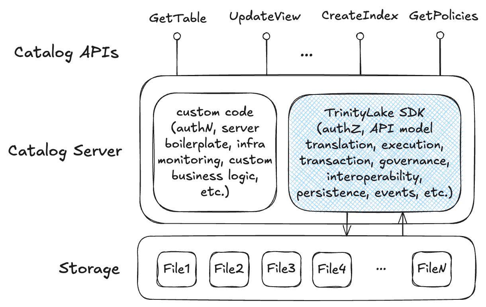

# Overview

As a storage-based format, TrinityLake can not only be used directly as a full lakehouse without a catalog,
but also as the implementation for a catalog to work with any open source or proprietary catalog API standards.

This would be useful for users that would like to maintain API level compatibility,
but are seeking for a scalable yet lightweight solution, 
where TrinityLake would take care of the majority of the catalog logic and do not require any extra dependencies than the storage. 
This leads to the following integration pattern:

For users that want a complete solution with open catalog standards, 
TrinityLake offers open source catalog standard servers like [an IRC server](./iceberg-rest.md). 
These servers are API compatible and serve as proxy server that uses the TrinityLake SDK to perform translation, authZ, execution, etc.

For users that would like to customize a catalog server solution, 
the TrinityLake SDK can also be used to flexibly fill in the different parts of logic in a catalog server,
so that users can choose to only implement the parts of the server that they want to customize,
and leave the rest to TrinityLake.